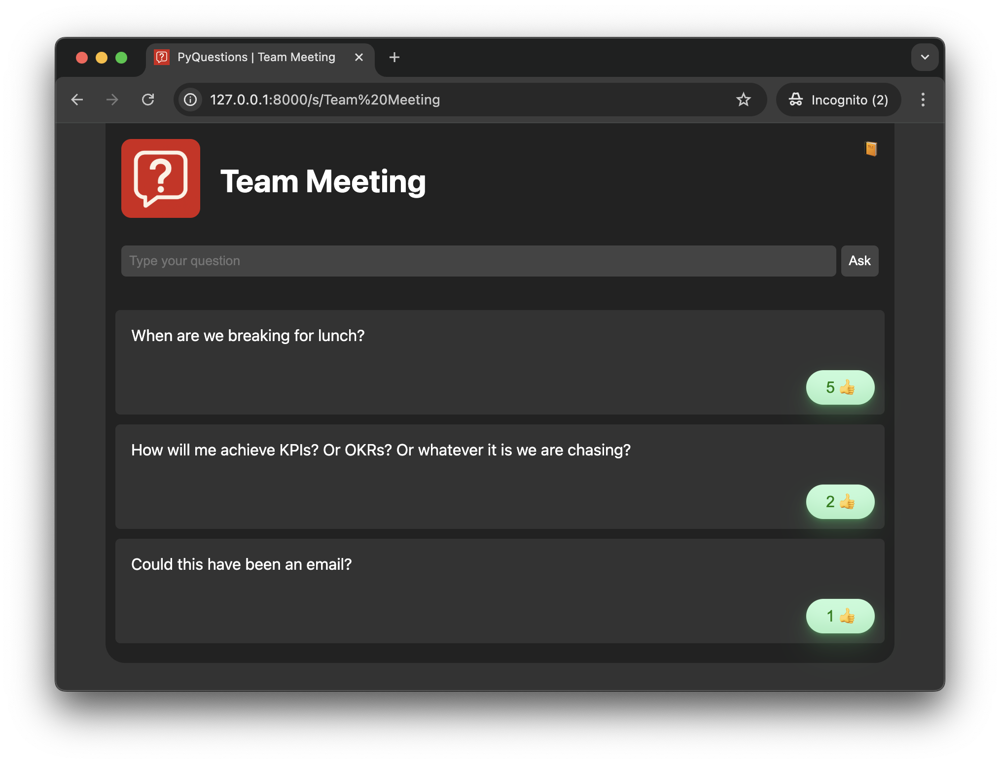

# PyQuestions Q&A Platform

Q&A platform based on Slido but more like Jitsi.




Allows users to create their own Q&A session and have people add questions and upvote them.


> [!IMPORTANT] 
> This is a pet project and I'm not really looking to maintain it much.
> Feel free to open MRs but I may not respond to them or accept them.

> [!CAUTION] 
> PyQuestions is not built with security in mind and shouldnt' be run on the open internet. > PyQuestions is intended to be run on a trusted network, like a corporate LAN.
> Any security in PyQuestions is for show and should not be relied upon.
> Q&A sessions are open to anyone who knows the URL.
> Similarly the Admin page for each session is only secured by a known URL; anyone with this URL can moderate the session.

# Running

## Building the Images

```bash
docker compose build
```

## Running the Images

### Configuration

Set the required environment variables. You should not use these values in production.

```bash
$ cat .env
PYQUESTIONS_INSTANCE_NAME="PyQuestions"
PYQUESTIONS_BASE_URL=http://localhost:8000
PYQUESTIONS_ADMIN_PASSWORD=adminpassword
MONGO_INITDB_ROOT_USERNAME=root
MONGO_INITDB_ROOT_PASSWORD=password
PYQA_WORKER_COUNT=1
```

You can also pass `PYQA_DEBUG=true` to use the built in Flask debug server rather than `gunicorn`.

If you want to override the logo, mount a suitable image file to `/usr/src/app/static/images/logo.png`.

### Running

```bash
docker compose up -d
```

You can now access PyQuestions at http://localhost:8000

# Using PyQuestions

See the Help page within the PyQuestions interface for details on using PyQuestions.
